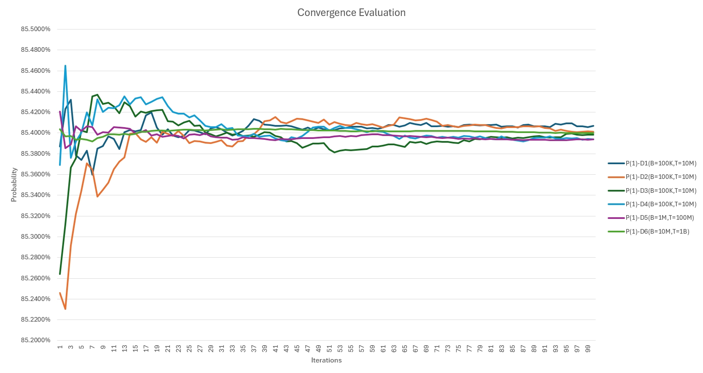

# Case Study: Solving a Real-Life Poisson–Binomial CDF Problem Using Monte Carlo Approach

**Author:** Samuel Zhang (+ 270 BAs)  
**Date:** 2025-08-16 

## Abstract

This case study investigates a real-life probability problem arising in a badminton signup chatroom, where participation is limited to n players and late signups enter a waiting list. Each participant has an empirically estimated dropout probability, and the admission chance of a waiting-list player depends on the distribution of earlier dropouts. Formally, this can be modeled as the **Cumulative Distribution Function (CDF) of a Poisson–Binomial distribution**.  

While an exact analytical solution exists, it requires advanced probability theory and computationally expensive algorithms. Instead, this study employs a **Monte Carlo Simulation** approach, which directly mirrors the real-world process of random participation. With modern computational power, Monte Carlo simulations are not only fast and scalable but also simple to implement, less error-prone, and flexible when adapting to different scenarios. The results demonstrate that Monte Carlo yields accurate and stable estimates of admission probabilities, making it a practical tool for solving complex probability problems in applied settings.


## Background
In the badminton signup chatroom, there is a participant limit of N. Anyone signing up after that limit enters a waiting list. If earlier participants drop out, waiting list members may move into the valid list. However, each participant has a personal dropout probability based on historical data.  

Thus, the **admission probability** of a waiting-list participant depends on the distribution of how many earlier players drop out.

### Real-Life Example
```
#接龙
Aug 15 周五 8-11 p.m 
✨打球地址: 170 Shields Court (Markham Badminton)
✨场地：4 5号
✨限制人数14位，从第15位开始进入waitlist！
✨周四晚上8⃣️点之后不可退接龙 如果有事🐦🐦 仍需付钱或转给别人 谢谢

☀️请大家自觉按照报名人数和时间
☀️非会员要额外支付$3(直接支付给su前台)

‼️开车的朋友们请大家切记把车停在unit 1指定停车位,停在unit 2 车位有可能会被拖车

1. Helen
2. June
3. Huiyi
4. Leah
5. Cheng
6. Victor
7. 小晨
8. 小新
9. 菲菲
10. Jason
11. Kevin
12. Kevin +1
13. Jassoonk
14. Carrie 雙
15. Anson
16. 0.0🦋
17. Henry Wang
18. RED
```

In this example, the author is **ranked #18** (i.e., **4th on the waiting list**, since only the first 14 are guaranteed). For the author to play, at least **4 earlier participants** must drop out.  

## Problem Identification

We model the number of dropouts as a **Poisson–Binomial random variable**:

- Each player $i$ has a dropout probability $p_i$.  
- Define independent Bernoulli random variables:

$$
X_i \sim \text{Bernoulli}(p_i), \quad i = 1, 2, \dots, n
$$

where $X_i = 1$ if player $i$ drops out, $0$ otherwise.  

- The total number of dropouts is:

$$
S = \sum_{i=1}^{n} X_i
$$

- $S$ follows a **Poisson–Binomial distribution** with parameters $(p_1, p_2, \dots, p_n)$.  

A waiting-list participant at position $r$ (i.e. the $(14+r)$-th signup) gets admitted if at least $r$ people drop out:

$$
P(\text{admission for position } r) = P(S \geq r)
$$

This is equivalent to:

$$
P(\text{admission}) = 1 - F(r-1)
$$

where $F(k)$ is the CDF of the Poisson–Binomial distribution:

$$
F(k) = P(S \leq k)
$$

## Data Preparation

### WeChat Message Synchronization

To obtain a complete copy of chat logs spanning multiple years, you need to synchronize messages from your phone to the PC client:

- [Settings] => [General] => [Manage Chat History] => [Import and Export Chat History]
- [Export to computer] => [Export only selected chat history] => choose chatroom (20644756264@chatroom)

By doing this, the PC client will have the full chat history for the selected chatroom. In this specific case, the history covers the period from 2023-04-06 to 2025-08-13.


### WeChat Database Decryption

WeChat PC Client uses a local SQLite database to store data such as chat logs; however, these files are encrypted. There are several open-source tools available for decryption. The one used in this project is [chatlog](https://github.com/sjzar/chatlog) by sjzar, originally developed for the MCP service to allow LLM-based AI assistants to access personal chat histories.

After automatic decryption, the decrypted SQLite database can be found at:

- \Users\[:username]\Documents\chatlog\[:wechatid]

    For privacy reasons, I will not be releasing the original decrypted SQLite database files, as they contain my complete chat history with individuals and chatrooms.

### Data Preprocessing

- Import SQLite databases into MySQL  
  The import script used is [sqlite3-to-mysql](https://github.com/techouse/sqlite3-to-mysql) by techouse.  
  This step is not strictly required; the main reason for performing it is to merge multiple SQLite databases into one and to work within a more robust RDBMS environment for data cleanup.

- Table: chatroom_msg  
  Contains the full chat log from 2023-04-06 to 2025-08-13 for the target chatroom 20644756264@chatroom.  
  Data file: [chatroom_msg.csv](data/chatroom_msg.csv)

- Table: chatroom_msg_groupnote  
  A trimmed dataset filtered from chatroom_msg, containing only signup-related messages.  
  Data file: [chatroom_msg_groupnote.csv](data/chatroom_msg_groupnote.csv)

- Table: signup_log_2025  
  A structured activity log parsed from chatroom_msg_groupnote, recording each participant’s join and drop actions since 2025.  
  Data file: [signup_log_2025.csv](data/signup_log_2025.csv)

- Table: drop_rate_2025  
  A statistical summary of each participant’s dropout probability, calculated from all activities since 2025.  
  Data file: [drop_rate_2025.csv](data/drop_rate_2025.csv)

From here, the dropout probabilities can be mapped directly into our Real-Life Example:
```
#接龙
Aug 15 周五 8-11 p.m
✨打球地址: 170 Shields Court (Markham Badminton)
✨场地：4 5号
✨限制人数14位，从第15位开始进入waitlist！
✨周四晚上8⃣️点之后不可退接龙 如果有事🐦🐦 仍需付钱或转给别人 谢谢
☀️请大家自觉按照报名人数和时间
☀️非会员要额外支付$3(直接支付给su前台)
‼️开车的朋友们请大家切记把车停在unit 1指定停车位,停在unit 2 车位有可能会被拖车
1. Helen (46.67%)
2. June (44.00%)
3. Huiyi (40.00%)
4. Leah (40.00%)
5. Cheng (13.04%)
6. Victor (21.28%)
7. 小晨 (31.03%)
8. 小新 (52.17%)
9. 菲菲 (11.11%)
10. Jason (23.33%)
11. Kevin (8.57%)
12. Kevin +1 (8.57%)
13. Jassoonk (14.00%)
14. Carrie 雙 (100.00%)
15. Anson (25.00%)
16. 0.0🦋 (33.33%)
17. Henry Wang (12.50%)
18. RED (0.00%)

list_p = [4667, 4400, 4000, 4000, 1304, 2128, 3103, 5217, 1111, 2333, 857, 857, 1400, 10000, 2500, 3333, 1250]
```


## Monte Carlo Simulation

### Simple Random
The simplest implementation is to use Python’s built-in `random` library. The core logic can be expressed in just three lines:
```python
list_rand = [random.randint(0, 10000) for _ in range(len(list_p))]
tmp = [p for p, r in zip(list_p, list_rand) if p < r]
return 1 if len(tmp) < limit else 0
```
Source code: [mc_simple_random.py](script/mc_simple_random.py) 

This approach is straightforward but not computationally efficient. Running 1,000,000 drafts takes about 20 seconds on a modern PC:
```
Out of 1000000 drafts:
Returned 1: 853594 times
Returned 0: 146406 times
Probability of returning 1: 0.8536
Probability of returning 0: 0.1464
Elapsed time for 1000000 drafts: 18.913014 seconds
```

### Vectorized Parallel

To achieve high performance, the simulation can be vectorized using NumPy and distributed across multiple CPU cores with Python’s `multiprocessing` module. Instead of generating random numbers one by one, an entire matrix of random values is created in a single call and compared against participant probabilities in bulk. Each worker process handles a chunk of drafts independently, and the results are aggregated at the end.

Worker function (vectorized with NumPy):
```python
def worker(list_p_np, limit, chunk_iters):
    list_rand_all = np.random.randint(0, 10001, size=(chunk_iters, len(list_p_np)))
    tmp_counts = np.sum(list_p_np < list_rand_all, axis=1)
    return np.sum(tmp_counts < limit)
```

Parallel driver (multiprocessing pool):
```python
def parallel_vectorized(list_p_np, limit, drafts, num_workers):
    chunk = drafts // num_workers
    remainder = drafts % num_workers
    tasks = [(list_p_np, limit, chunk) for _ in range(num_workers)]
    if remainder > 0:
        tasks[0] = (list_p_np, limit, chunk + remainder)
    with mp.Pool(num_workers) as pool:
        counts_1 = pool.starmap(worker, tasks)
    total_1 = sum(counts_1)
    total_0 = drafts - total_1
    return total_1, total_0
```
Source code: [mc_vectorized_parallel.py](script/mc_vectorized_parallel.py) 

Example benchmark:
```
Final results:
Total drafts: 1,000,000
Returned 1: 852,896
Returned 0: 147,104
Final Probability of returning 1: 0.85289600
Final Probability of returning 0: 0.14710400
Elapsed time: 0.1776 seconds

Final results:
Total drafts: 10,000,000
Returned 1: 8,540,964
Returned 0: 1,459,036
Final Probability of returning 1: 0.85409640
Final Probability of returning 0: 0.14590360
Elapsed time: 1.5485 seconds
```

Compared with the simple random approach (≈19 seconds for 1M drafts),
this vectorized parallel method achieves a **100X SPEEDUP**, making Monte Carlo simulation practical for very large runs (1B+ drafts) on commodity hardware.

### Convergence Evaluation
Monte Carlo simulation results are inherently statistical estimates. As the number of drafts increases, the estimated probability converges toward the true analytical value. To evaluate convergence, the simulation was run in batches, recording the probability of returning 1 after each batch.

#### Evaluation Design
Six independent Monte Carlo experiments were carried out with different **Batch sizes (B)** and **Total draft (T)**:

- **D1–D4**: B = 100,000, T = 10M  
- **D5**: B = 1M, T = 100M  
- **D6**: B = 10M, T = 1B  

At the end of each batch, the probability of returning `1` was computed and tracked over iterations. This allows monitoring of convergence behavior and variance reduction under different computational settings.

#### Result Analysis

Result data: [convergence_evaluation.csv](data/convergence_evaluation.csv) 

1. **Stability of Estimates**  
   All six runs converge rapidly to a value around **85.40%**, with only minor fluctuations after the first few iterations.

2. **Impact of Batch Size**  
   Larger batch sizes (D5, D6) produce smoother convergence curves with less noise, while smaller batches (D1–D4) show more short-term oscillation.  

3. **Consistency Across Scales**  
   Despite differences in batch size and iteration counts, the final probabilities across all experiments differ by less than **±0.02%**. This confirms the robustness of the estimate.

4. **Law of Diminishing Returns**  
   Increasing total drafts from 10M to 100M or even 1B does reduce variance further, but the improvement is marginal compared to the computational cost.

Therefore, running **10 million drafts** is sufficient. The resulting probability stabilizes at about **85.40%**, with an accuracy level of approximately **±0.02%**. Larger-scale simulations confirm the result but are not necessary for practical purposes.

## Analytical Solution

To provide a benchmark for the Monte Carlo results, an exact analytical solution was implemented using the **Poisson–binomial distribution**. This distribution models the sum of independent Bernoulli random variables with different success probabilities, which matches our dropout setting.

The probability mass function can be computed via **dynamic programming**:

$$
f^{(i)}(k) = (1 - q_i)\, f^{(i-1)}(k) + q_i\, f^{(i-1)}(k-1),
$$

where $f^{(i)}(k)$ is the probability of having exactly $k$ dropouts after considering the first $i$ players, and $q_i$ is the dropout probability for player $i$.

After processing all $n$ players, the cumulative distribution function (CDF) is:

$$
F(k) = \Pr(S \leq k) = \sum_{j=0}^k f^{(n)}(j),
$$

where $S$ is the total number of dropouts.  

The target probability for player $r$ is then:

$$
\Pr(S \geq r-14) = 1 - F(r-15).
$$

Core Logic:
```python
def poisson_binomial_cdf_less_than(q, L):
    """Exact P(S < L) for S = sum Bernoulli(q_i), via O(n*L) DP."""
    q = np.asarray(q, dtype=np.float64)
    n = q.size
    if L <= 0:
        return 0.0
    if L > n:
        return 1.0

    f = np.zeros(L, dtype=np.float64)
    f[0] = 1.0
    for qi in q:
        kmax = min(L - 1, n)
        for k in range(kmax, 0, -1):
            f[k] = f[k] * (1.0 - qi) + f[k - 1] * qi
        f[0] *= (1.0 - qi)
    return float(f.sum())
```
Source code: [analytical_method.py](script/analytical_method.py) 

Example benchmark:
```
n = 17, limit = 14
Exact P(S < 14) = 0.8540000479
```

## Conclusion

This case study shows that a real-life admission probability problem in a badminton signup system can be rigorously modeled using the Poisson–binomial distribution. While the analytical solution via dynamic programming provides an exact benchmark, it requires specialized probability theory and careful implementation.  

By contrast, the Monte Carlo simulation approach proved to be:  

- **Accurate** – With 10 million drafts, the simulation converged to the analytical probability of ≈85.40%, with discrepancies below ±0.02%.  
- **Efficient** – A vectorized parallel implementation completed the full 10M-draft simulation in just 1.55 seconds on a modern PC, making it practical even for real-time use.  
- **Practical** – The method is simple to implement, reduces the risk of mathematical error, and adapts easily to different scenarios.  

In conclusion, given sufficient compute power, Monte Carlo simulation is a robust, scalable, and accessible tool that delivers both speed and accuracy in solving complex probability problems.  


## Further HPC Challenge  
**Update: 2025-08-18**

According to the Convergence Evaluation section, running 10 million drafts is already sufficient—both accurate and reasonably fast—for the admission probability problem studied here. Larger-scale simulations confirm the result but are not necessary for practical purposes.  

Nevertheless, this project naturally extends into a high-performance computing (HPC) challenge: how far can we push Monte Carlo simulation with modern hardware? The journey illustrates a clear progression:  

1. Simple Random – a naïve Python loop using the built-in `random` module. Easy to write, but slow (≈19 seconds for 1M drafts).  
2. Vectorized Parallel – optimized NumPy + multiprocessing, achieving ≈100× speedup on CPUs by exploiting SIMD and multicore parallelism.  
3. GPU Acceleration – running the same simulation on GPUs, which are designed for massive vector and parallel compute, enables billion-scale drafts in under a second.  
Source code: [mc_pytorch_dual_gpu.py](script/mc_pytorch_dual_gpu.py)  

### Benchmark: 1 Billion Drafts  

| Method                  | Environment               | Elapsed Time | P(1)       | P(0)       |
|-------------------------|---------------------------|--------------|------------|------------|
| Simple Random (Python)  | Single-thread Python RNG  | ~4.1 hours*  | ~0.854     | ~0.146     |
| Vectorized Parallel CPU | 36-core Xeon, NumPy + mp  | 21.12 s      | 0.85399439 | 0.14600561 |
| Dual GPU Acceleration   | 2× Radeon Instinct MI50   | 0.49 s       | 0.85386836 | 0.14613164 |

\*Estimated by scaling from 1M drafts = 14.8 s.  

This shows an impressive progression: from hours on naïve Python code, to tens of seconds with optimized CPU vectorization, to sub-second runtimes with dual GPUs. The GPU solution is not strictly required for the badminton example, but it demonstrates how Monte Carlo simulation scales as a general-purpose HPC technique. Future work could extend this to multi-GPU clusters for even more complex or correlated stochastic models.  
